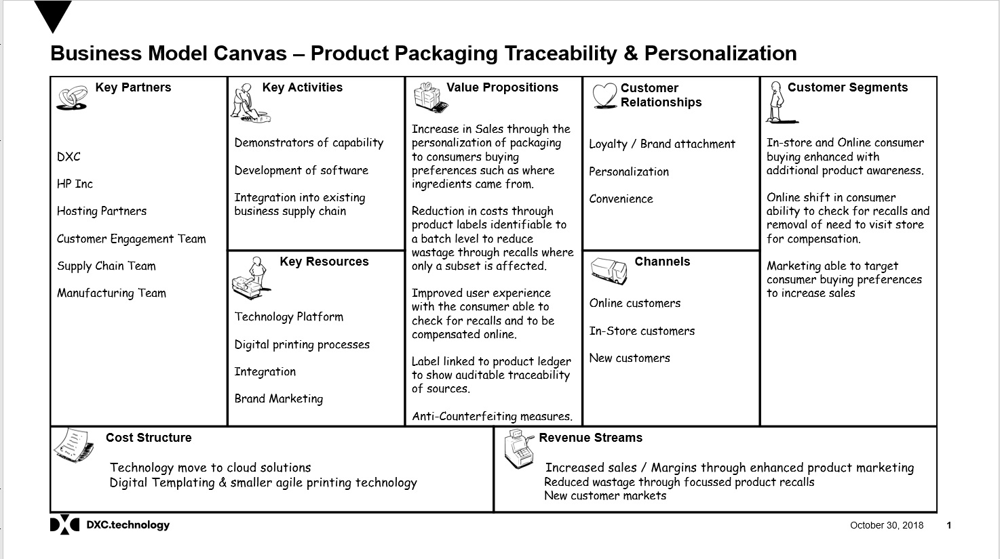
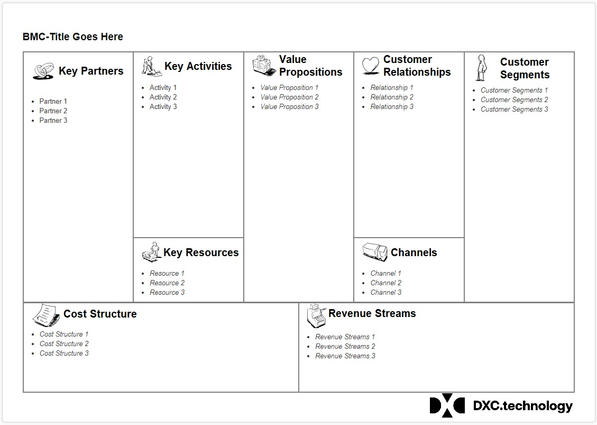
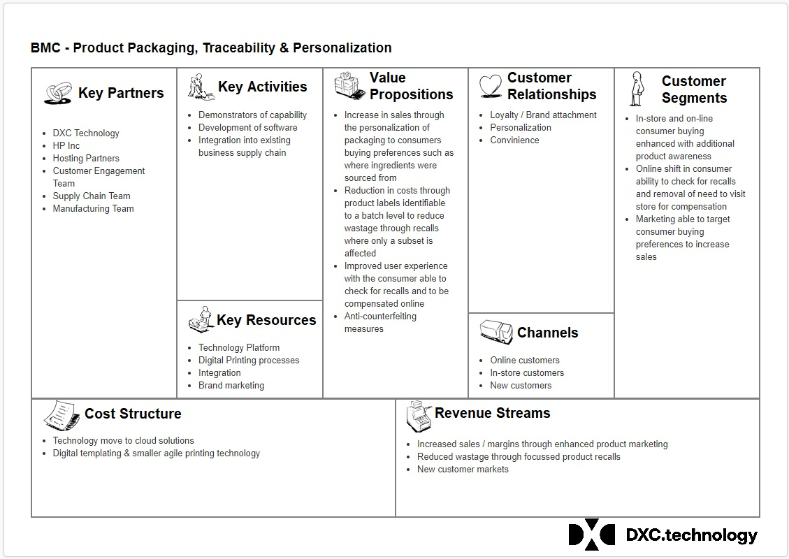

# Business Model Canvas as Code

This project is to codify the Business Model Canvas Powerpoint document.

Two main compnents are the HTML file and the images stored in the \images folder. By editing the HTML Lists and adding the BMC title a new canvas can be created.

## Screenshots of the process

The original Powerpoint to be codified:

The Templated HTML document:

The codified version of the original Powerpoint:

## Next Steps

Looking to externalise the changeable data so that it is easier to complete the input. Looking at maybe pulling in JSON data feeds. If anyone wishes to have a go before I get the time to look at it then feel free to fork and push your updates.
